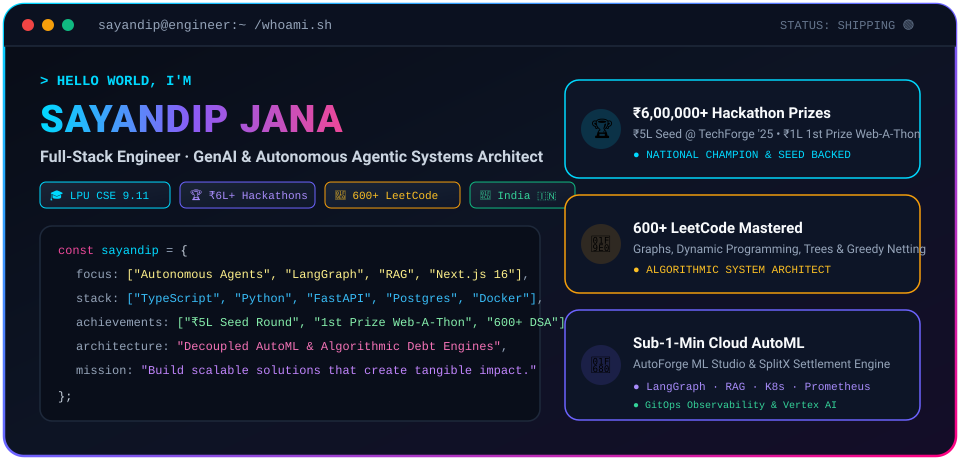
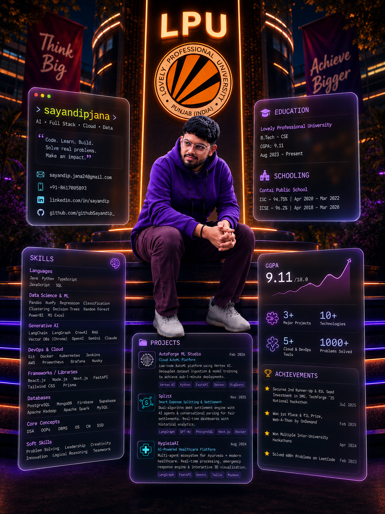
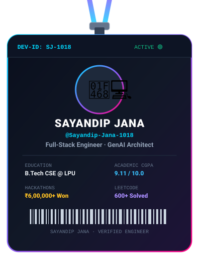
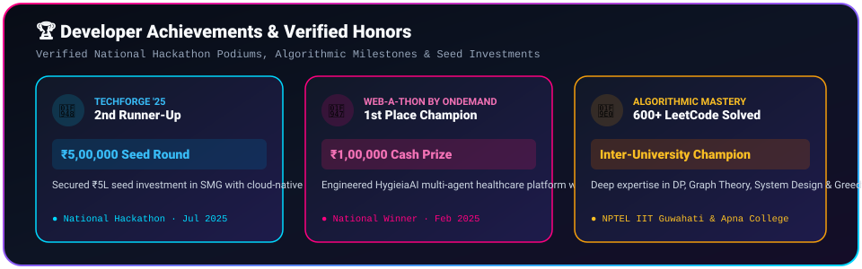
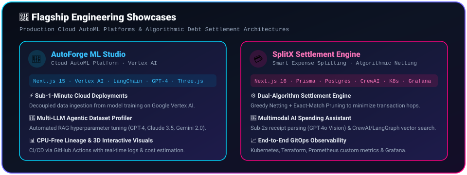

  <!-- ==================== HERO CYBER TERMINAL BANNER ==================== -->
  <picture>
    <source media="(prefers-color-scheme: dark)" srcset="./banner.svg" />
    
  </picture>

    

  <!-- ==================== LIVE VISITOR & FOLLOWER COUNTERS ==================== -->
  

    
    &nbsp;
    
    &nbsp;
    
    &nbsp;
    
  

   

  <!-- ==================== SIGNATURE AI PORTRAIT ==================== -->
  

    
  

---

  <h2 align="center">🪪 Developer ID &amp; Credentials</h2>

   

  <!-- ==================== DEVELOPER LANYARD ID CARD ==================== -->
  

    
  

---

  <h2 align="center">🏆 Verified Honors &amp; Hackathon Podiums</h2>

   

  <!-- ==================== FLOATING ACHIEVEMENTS CARD ==================== -->
  

    
  

---

  <h2 align="center">🚀 Flagship Engineering Showcases</h2>

   

  <!-- ==================== FLOATING PROJECTS SHOWCASE CARD ==================== -->
  

    
  

   

  

    
    &nbsp;
    
  

   

  

    
    &nbsp;
    
    &nbsp;
    
  

---

  <h2 align="center">🛠️ Technical Arsenal &amp; Ecosystem</h2>

   

  <!-- ==================== SKILL ICONS GRID ==================== -->
  

    
  

  

    <b>Core Specializations:</b> Autonomous Agents (LangGraph · CrewAI) • Production RAG &amp; Vector DBs • High-Throughput APIs (FastAPI · Next.js 16) • Cloud-Native GitOps (Docker · K8s · Prometheus · Grafana)
  

---

  <h2 align="center">📊 Live GitHub &amp; Algorithmic Analytics</h2>

   

  <!-- Streak Stats Card -->
  

    

  <!-- Activity Graph -->
  

    

  <!-- LeetCode Card -->
  

---

  <h2 align="center">🐍 Contribution Snake</h2>

   

  

    <picture>
      <source media="(prefers-color-scheme: dark)" srcset="https://raw.githubusercontent.com/Sayandip-Jana-1018/Sayandip-Jana-1018/output/github-snake-dark.svg" />
      <source media="(prefers-color-scheme: light)" srcset="https://raw.githubusercontent.com/Sayandip-Jana-1018/Sayandip-Jana-1018/output/github-snake.svg" />
      
    </picture>
  

---

  <h2 align="center">🔌 Connect With Me</h2>

   

  

    
    &nbsp;
    
    &nbsp;
    
    &nbsp;
    
    &nbsp;
    
  

   

  

    ⚡ <b>Always open to high-impact GenAI engineering roles, scalable system design collaborations &amp; open-source innovation.</b>
  

    

